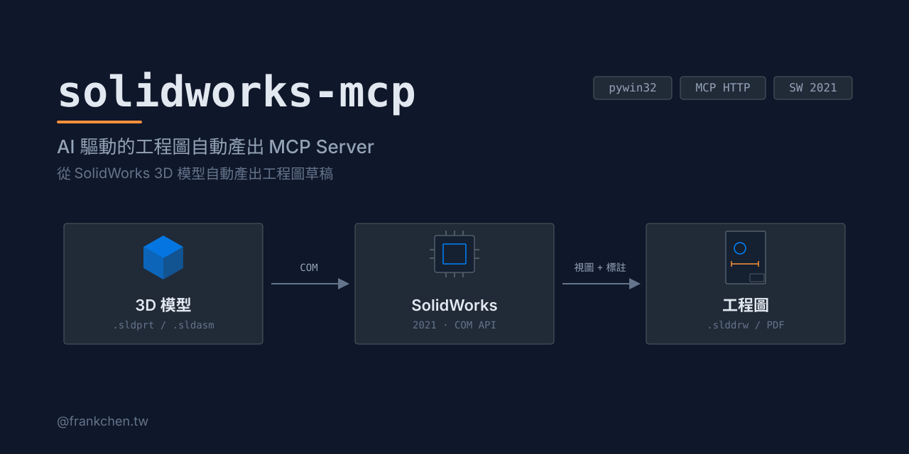

# solidworks-mcp

[](https://github.com/haunchen/solidworks-mcp/actions/workflows/ci.yml)
[](LICENSE)
[](pyproject.toml)

English | [繁體中文](README.zh-TW.md)

An MCP server that lets Claude — or any MCP client that speaks Streamable HTTP — drive **SolidWorks 2021** to create engineering drawings over your LAN, through the pywin32 COM API.

Open a part, generate first-angle standard views, add dimensions and balloons, insert a BOM table, then export to PDF — all from a Claude conversation.

## Features

**21 tools** in 5 categories:

| Category | Tools |
|----------|-------|
| File operations (3) | open / close / list documents |
| Drawing views (6) | create drawing from template, standard views, first-angle aligned 3-view, section view, detail view, custom-orientation view |
| Annotation (6) | import model dimensions, probe edges, add dimensions (linear / diameter / radius / angle), auto reference dimensions, balloons, BOM table |
| Export (4) | capture drawing (JPEG), capture model views, save as PDF, save drawing |
| Assembly analysis (2) | read mates, read feature tree |

See the full [tool reference](#tool-reference) below.

## Architecture

```
Claude Code ◄── Streamable HTTP ──► src/server.py (FastMCP)
                                         │
                                    async tool handlers
                                         │
                                    sw.execute(func)  ← asyncio + Future
                                         │
                                    COM Worker Thread (STA, singleton)
                                         │
                                    pywin32 COM → SolidWorks 2021
```

SolidWorks COM must be driven from a single STA thread. All tool handlers are async and dispatch their COM callables onto a dedicated worker thread, bridged back with `concurrent.futures.Future`.

## Requirements

- Windows 10/11 host with **SolidWorks 2021** installed
- **Python 3.10+**
- An MCP client that supports Streamable HTTP (e.g. Claude Code, Codex CLI, Gemini CLI, Cursor — see [Compatible MCP clients](#compatible-mcp-clients)) on the same **trusted LAN**
- Optional: a drawing template (`.drwdot`) and an SMB shared folder for large screenshots / PDFs

> Only SolidWorks 2021 has been tested. Other versions may work since the COM API is largely stable, but no guarantees.

## Quick Start

### 1. Install (on the SolidWorks host)

```powershell
git clone https://github.com/haunchen/solidworks-mcp.git
cd solidworks-mcp
python -m venv .venv
.venv\Scripts\pip install -r requirements.txt
```

<details>
<summary>Offline installation (host without internet access)</summary>

On a machine with internet access:

```powershell
pip download -d ./wheels -r requirements.txt
```

Copy the repo (including `wheels/`) to the SolidWorks host, then:

```powershell
.venv\Scripts\pip install --no-index --find-links wheels -r requirements.txt
```

</details>

### 2. Configure

```powershell
Copy-Item .env.example .env
# edit .env — see Configuration below
```

### 3. Run

```powershell
.venv\Scripts\python src\server.py
```

### 4. Connect from Claude Code (client machine)

```bash
claude mcp add --transport http solidworks http://<sw-host>:8080/mcp
```

Then just ask Claude: *"Open bracket.sldprt and create a first-angle 3-view drawing with dimensions, then export it as PDF."*

## Compatible MCP clients

Any MCP client that supports **Streamable HTTP** and runs on your machine (or inside the LAN) can connect. Verified examples:

| Client | Config |
|--------|--------|
| Claude Code | `claude mcp add --transport http solidworks http://<sw-host>:8080/mcp` |
| Codex CLI | `config.toml`: `[mcp_servers.solidworks]`<br>`url = "http://<sw-host>:8080/mcp"` |
| Gemini CLI | `gemini mcp add --transport http solidworks http://<sw-host>:8080/mcp` |
| Cursor | `mcp.json`: `{ "mcpServers": { "solidworks": { "url": "http://<sw-host>:8080/mcp" } } }` |
| VS Code Copilot | `.vscode/mcp.json`: `{ "servers": { "solidworks": { "type": "http", "url": "http://<sw-host>:8080/mcp" } } }` |
| Cline | `cline_mcp_settings.json`: `{ "mcpServers": { "solidworks": { "type": "streamableHttp", "url": "http://<sw-host>:8080/mcp" } } }` |
| Windsurf | `~/.codeium/windsurf/mcp_config.json`: `{ "mcpServers": { "solidworks": { "serverUrl": "http://<sw-host>:8080/mcp" } } }` |
| Continue / Zed / JetBrains AI Assistant / opencode / Goose | see their MCP docs (`url` / `uri` field) |

Agent frameworks work too: OpenAI Agents SDK (`MCPServerStreamableHttp`), LangChain (`langchain-mcp-adapters`).

> Cloud-brokered connectors cannot reach a LAN-only server: Claude Desktop / claude.ai custom connectors and the Anthropic Messages API MCP connector all connect from the vendor's cloud, which is exactly what the trusted-LAN security model blocks.

## Configuration

All settings are loaded from `.env` (see `.env.example`):

| Variable | Default | Description |
|----------|---------|-------------|
| `SW_MCP_HOST` | `0.0.0.0` | Address the server binds to |
| `SW_MCP_PORT` | `8080` | Server port |
| `SW_MCP_SMB_PATH` | `C:\mcp-share` | Server-side folder for screenshots / PDFs that exceed the base64 limit |
| `SW_MCP_SMB_CLIENT_PATH` | (empty) | The same folder as seen from the client (e.g. `U:\mcp-share`); used to rewrite returned paths |
| `SW_MCP_TEMPLATE` | (empty) | Drawing template (`.drwdot`) used by `create_drawing` |
| `SW_MCP_PAPER_SIZE` | `A3` | Default paper size |
| `SW_MCP_MAX_BASE64` | `1048576` | Max screenshot size (bytes) returned inline as base64; larger images are saved to the shared folder |

## Security

**This server has no authentication.** Anyone who can reach the port can drive your SolidWorks instance and read/write files through it.

- Deploy on a **trusted LAN only** — never expose the port to the internet
- Prefer binding `SW_MCP_HOST` to a specific LAN interface instead of `0.0.0.0`
- Consider OS-level firewall rules restricting access to known client IPs

## Tool Reference

### File operations

| Tool | Description |
|------|-------------|
| `open_document` | Open a SolidWorks document (`.sldprt` / `.sldasm` / `.slddrw`) |
| `close_document` | Close the specified document |
| `list_open_documents` | List all documents currently open in SolidWorks |

### Drawing views

| Tool | Description |
|------|-------------|
| `create_drawing` | Create a new drawing document from a template |
| `insert_standard_views` | Insert independent standard views (no projection alignment, custom scale) |
| `insert_standard_views_aligned` | Create first-angle aligned front / top / right views with auto scale |
| `insert_section_view` | Create a section view on a parent view |
| `insert_detail_view` | Create a detail (magnified) view on a parent view |
| `insert_custom_view` | Insert a named-orientation or arbitrary XYZ-rotation view |

### Annotation

| Tool | Description |
|------|-------------|
| `insert_model_dimensions` | Import model dimensions into drawing views |
| `probe_drawing_edges` | Inspect visible edges (index / type / coordinates in mm) before dimensioning |
| `add_dimension` | Add a linear / diameter / radius / angle dimension between probed edges |
| `auto_add_reference_dimensions` | Auto-add reference dimensions (bounding box + circles) for non-parametric geometry |
| `insert_balloon` | Insert balloons on an assembly drawing view (optionally filtered by component) |
| `insert_bom_table` | Insert a top-level-only BOM table |

### Export

| Tool | Description |
|------|-------------|
| `capture_drawing` | Capture the current drawing as JPEG (inline base64 or shared-folder path) |
| `capture_view` | Capture multi-angle screenshots from the 3D model |
| `save_as_pdf` | Export the current drawing to PDF |
| `save_drawing` | Save the current drawing (`.slddrw`) |

### Assembly analysis

| Tool | Description |
|------|-------------|
| `read_assembly_mates` | Read all mate relationships of a component in an assembly |
| `get_feature_tree` | Read the feature tree of a document |

## Development

```powershell
# run all tests (no SolidWorks needed — the COM layer is fully mocked)
.venv\Scripts\pytest tests/ -v
```

Behavior contracts live in `docs/specs/` — specs with `status: active` describe the expected behavior of shipped features. Design history is in `docs/plans/`.

See [CONTRIBUTING.md](CONTRIBUTING.md) for development setup and PR guidelines.

## License

[MIT](LICENSE)
